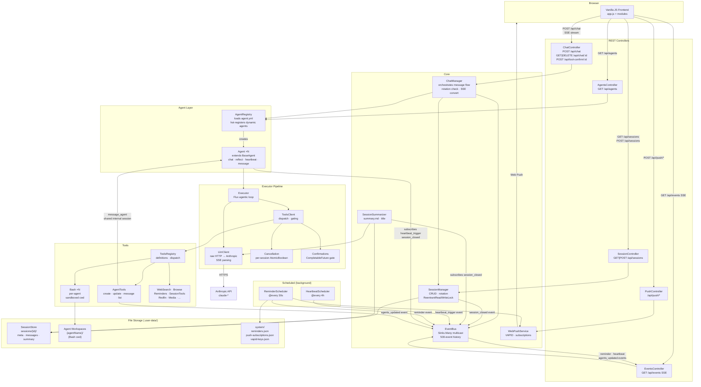

# lifeos — System Design

## Overview

lifeos is a personal life-OS agent built on:
- **Backend**: Spring Boot 3.5 (Java 25) + WebFlux (reactive, non-blocking)
- **Frontend**: Vanilla JS (ES modules) + SSE streaming
- **LLM**: Raw HTTP to Anthropic API — no SDK, line-by-line SSE parsing
- **Storage**: Flat files under `.user-data/` — no database

---

## Runtime Architecture Diagram



---

## Package Structure

```
com.lifeos
├── config/            AppConfig (@ConfigurationProperties record)
├── api/               REST controllers
├── core/
│   ├── agents/        Agent classes, AgentRegistry, SessionSummarizer
│   │   ├── executor/  Executor, LlmClient, ToolsClient, Cancellation, Confirmations, events/
│   │   └── tools/     ToolsRegistry, Bash, AgentTools, SessionTools, Reminders, ...
│   ├── helpers/       EventBus, PromptParts, Hooks
│   ├── managers/      ChatManager, SessionManager, WebPushService, HeartbeatScheduler, ReminderScheduler
│   └── store/         SessionStore
```

---

## Class Hierarchy

### Agent Layer

```
BaseAgent  (abstract)
└── Agent  (concrete — one instance per agent definition)
```

`Agent` delegates everything to `AgentDefinition` (a record parsed from `agent.yml`):

```
AgentDefinition  (record)
└── ToolsFilter  (nested record — mode: include|exclude, names: [...])
```

### Executor Events

```
ExecutorEvent  (marker interface)
├── LlmEvent  (sealed interface)
│   ├── LlmEvent.Request    (record)
│   ├── LlmEvent.Text       (record)
│   ├── LlmEvent.ToolCall   (record)
│   └── LlmEvent.Response   (record)
├── ToolEvent  (sealed interface)
│   ├── ToolEvent.ConfirmRequest  (record)
│   ├── ToolEvent.ConfirmDenied   (record)
│   ├── ToolEvent.Result          (record)
│   └── ToolEvent.Cancelled       (record)
└── AgentAppendEvent  (record)
```

### Configuration

```
AppConfig  (record — @ConfigurationProperties prefix = "lifeos")
├── model: String              — chat model (e.g. claude-sonnet-4-6)
├── reflectModel: String       — reflect/heartbeat/summarize model
├── anthropicApiKey: String
├── Paths  (nested record)
│   ├── environment: String
│   └── user: String
└── Session  (nested record)
    ├── tokenThreshold: int    — rotation at N tokens
    └── timeThresholdHours: int
```

---

## Component Map

```
HTTP Request
     │
     ▼
ChatController
     │  POST /api/chat
     ▼
ChatManager                         ← checks rotation, serializes SSE
     │
     ▼
AgentRegistry ──────────────────── loads agent.yml + .md files at startup
     │                               hot-registers dynamic agents at runtime
     ▼
Agent (extends BaseAgent)
     │  chat() / reflect() / heartbeat() / message()
     ▼
Executor  ──────────────────────── Flux.defer().repeat().takeUntil() loop
     ├── LlmClient                  raw HTTP POST → Anthropic, SSE parsing
     └── ToolsClient                tool dispatch + gating (Confirmations)
               │
               ▼
         ToolsRegistry              definitions (Anthropic schema) + dispatch router
               ├── Bash             per-agent scoped shell, path-sandboxed
               ├── AgentTools       create/update/list/message agents
               ├── SessionTools     list/read sessions
               ├── WebSearch, Browse, Media, Redfin, PropertyReport
               └── ReminderScheduler.store()
```

### Supporting Singletons

```
EventBus              in-memory Sinks.Many multicast; glue between all async components
SessionManager        session CRUD + rotation (ReentrantReadWriteLock)
SessionStore          raw file I/O → .user-data/sessions/
SessionSummarizer     session_closed → summary.md + title (reflectModel)
HeartbeatScheduler    @Scheduled 30min → publishes heartbeat_trigger event
ReminderScheduler     @Scheduled 30s   → polls due reminders → SSE + Web Push
WebPushService        VAPID keypair, subscription registry, push delivery
Cancellation          ConcurrentHashMap<sessionId, AtomicBoolean>
Confirmations         ConcurrentHashMap<requestId, CompletableFuture<Boolean>>
Hooks                 lifecycle hook dispatcher via EventBus
PromptParts           static util — loads classpath /{base}/{name} with .user-data override
```

---

## Agents Subsystem

### Config-Driven Loading

No Java subclass is needed per agent. `AgentRegistry` scans two locations at startup:

1. **Classpath** `agents/*/agent.yml` — built-in agents (e.g. `cos`)
2. **Filesystem** `.user-data/agents/*/agent.yml` — user-created dynamic agents

Each `agent.yml` is parsed into an `AgentDefinition`, then wrapped in a generic `Agent` instance. Dynamic agents can be hot-created at runtime via the `create_agent` tool — `AgentRegistry.register()` wires them immediately and `EventBus` emits `agents_updated` to refresh the frontend.

### agent.yml Schema

```yaml
name: my_agent
title: My Agent
description: ...
persona:
  - who-you-are.md
  - chat.md
reflect-prompt:
  - reflect.md
heartbeat-prompt: heartbeat.md
chat-tools:
  mode: include        # include | exclude (omit for all tools)
  names: [agent_bash, message_agent, ...]
reflect-tools:
  mode: include
  names: [agent_bash, get_current_datetime]
```

### BaseAgent Template Methods

| Method | Purpose | Default |
|--------|---------|---------|
| `persona()` | Identity + instructions system prompt | abstract |
| `memory()` | Knowledge section appended to system prompt | `""` |
| `tools()` | Tools for chat mode | all tools |
| `reflectPrompt()` | System prompt for post-session reflection | `null` (skip) |
| `reflectTools()` | Tools for reflection | all tools |
| `heartbeatPrompt()` | System prompt for scheduled heartbeat | `null` (skip) |
| `heartbeatTools()` | Tools for heartbeat | reflectTools() |
| `messagePrompt()` | System prompt for agent-to-agent messaging | generic framing |
| `messageTools()` | Tools for messaging | reflectTools() |

### Agent-to-Agent Messaging

`message_agent` invokes `BaseAgent.message(fromAgent, content)` on the target, which runs a full agentic loop with a dedicated internal session keyed `internal-{sender}-to-{receiver}`.

---

## Executor Pipeline

```
Executor.runLoop(sessionId, messages, system, model, tools, agentName)
  returns Flux<ExecutorEvent>

Loop iteration:
  1. LlmClient.stream()     → yields LlmEvent.Text / LlmEvent.ToolCall / LlmEvent.Response
  2. if stop_reason == "tool_use":
       ToolsClient.invoke()  → yields ToolEvent.Result / ToolEvent.ConfirmRequest / ToolEvent.Cancelled
       append tool results to messages
       continue loop
  3. else:
       emit AgentAppendEvent (persist to session history)
       takeUntil fires — loop ends
```

Both `LlmClient` and `ToolsClient` use `Executors.newVirtualThreadPerTaskExecutor()` for blocking I/O, keeping the WebFlux event loop free.

**Tool Gating**: Certain tools (e.g. `run_python`, `chrome_*`) are gated behind `Confirmations` — a `CompletableFuture<Boolean>` blocks the tool thread until the user approves/denies via `POST /api/tool-confirm/{requestId}`.

---

## Tools System

### ToolsRegistry

Central hub — holds tool definitions in Anthropic schema format and routes `dispatch(toolName, input, agentName)` calls to the right implementation.

### Bash Workspace Isolation

Each agent gets a `Bash` instance scoped to `.user-data/{agentName}/`. Security rules:
- Blocks path traversal (`../`), absolute-path redirects, network tools (`curl`, `wget`, `ssh`), privilege escalation (`sudo`)
- **Read-only mode**: additionally blocks all WRITE_OPS patterns (`rm`, `cp`, `mv`, `>`, `>>`, etc.)
- Agents can only access their own workspace via `agent_bash`; to get another agent's current state, use `message_agent` to ask them directly

### Available Tools

| Tool | Description |
|------|-------------|
| `agent_bash` | Full read/write bash in agent's workspace |
| `message_agent` | Send message to another agent |
| `list_agents` | List all registered agents |
| `read_agent_definition` | Read another agent's YAML + prompt files |
| `create_agent` / `update_agent` | Spawn or modify dynamic agents |
| `list_tools` | List all available tools |
| `list_sessions` | List recent sessions |
| `read_session_summary` | Read a session's summary.md |
| `read_session_transcript` | Read full session transcript |
| `set_reminder` / `list_reminders` / `delete_reminder` | Reminder CRUD |
| `get_current_datetime` | Current ISO timestamp |
| `web_search` | DuckDuckGo search |
| `browse_page` | Fetch and parse a web page (Jsoup) |
| `show_image` | Display image in UI |
| `parse_redfin_listing` / `parse_redfin_search` | Redfin real estate parsing |
| `property_report` | Property analysis |

---

## Session & Storage

### Session Model

Flat — no conversation wrapper. Each session lives at `.user-data/sessions/{sessionId}/`:

```
meta.json        id, title, agent, created_at, last_message_at, token_count, parent_session_id
messages.json    full message history (role, content, _ts)
summary.md       written by SessionSummarizer after rotation
```

`pointers.json` at root maps pointer keys (e.g. `agent:cos`) → current `sessionId`.

### Rotation

`SessionManager.checkRotation()` fires on every incoming message. Rotates when:
- `token_count > tokenThreshold` (default 50k), or
- `now - last_message_at > timeThresholdHours` (default 4h)

On rotation:
1. Emits `session_closed` event → `SessionSummarizer` writes `summary.md` + title
2. Creates new session with `parent_session_id` pointer
3. Old session's summary is injected into next session's system prompt as `# Session Context`

### Reflection Pipeline

Triggered by `session_closed` (for `SessionSummarizer`) and indirectly at rotation for each agent's `reflect()`:

```
session_closed event
  → SessionSummarizer.run()       — reflectModel; writes summary.md + title
  → BaseAgent.reflect()           — reflectModel; agent updates its workspace files
```

---

## Event Bus & Async

`EventBus` is the nervous system — a `Sinks.Many<Map<String, Object>>` multicast sink with a 500-event history buffer.

Key events:

| Event type | Publisher | Subscriber(s) |
|------------|-----------|---------------|
| `session_closed` | `SessionManager.rotate()` | `SessionSummarizer`, `BaseAgent` |
| `heartbeat_trigger` | `HeartbeatScheduler` | `BaseAgent` (each) |
| `heartbeat` | `BaseAgent` | `EventsController` (SSE to frontend) |
| `reminder` | `ReminderScheduler` | `EventsController` (SSE to frontend) |
| `agents_updated` | `AgentTools` | frontend (`loadAgents()`) |

The frontend connects to `GET /api/events` (SSE stream) and `GET /api/events` history on load.

---

## REST API

| Method | Route | Handler | Purpose |
|--------|-------|---------|---------|
| POST | `/api/chat` | `ChatController` | Send message, stream SSE response |
| GET | `/api/chat/{sessionId}` | `ChatController` | Load chat history |
| DELETE | `/api/chat/{sessionId}` | `ChatController` | Clear session |
| POST | `/api/chat/{sessionId}/truncate` | `ChatController` | Truncate history at index |
| POST | `/api/chat/{sessionId}/stop` | `ChatController` | Cancel in-progress response |
| POST | `/api/tool-confirm/{requestId}` | `ChatController` | Approve/deny gated tool |
| GET | `/api/sessions` | `SessionController` | List recent sessions |
| POST | `/api/sessions` | `SessionController` | Create new session |
| GET | `/api/agents` | `AgentsController` | List all registered agents |
| GET | `/api/events` | `EventsController` | SSE event stream |
| GET | `/api/push/vapid-public-key` | `PushController` | Get VAPID public key |
| POST | `/api/push/subscribe` | `PushController` | Register push subscription |
| POST | `/api/push/unsubscribe` | `PushController` | Deregister push subscription |

---

## Configuration (`application.yml`)

```yaml
lifeos:
  model: claude-sonnet-4-6          # model for agent chat turns
  reflect-model: claude-opus-4-6    # model for reflect, heartbeat, summarize
  anthropic-api-key: ${ANTHROPIC_API_KEY}
  paths:
    environment: .user-data/environment
    user: .user-data/user
  session:
    token-threshold: 50000          # rotate at N tokens
    time-threshold-hours: 4         # rotate after N hours inactivity
  heartbeat:
    interval-ms: 1800000            # heartbeat every 30 minutes
```

---

## Key Architectural Patterns

**Config-driven agents** — Agents are data, not code. `agent.yml` + `.md` files fully define behavior. `AgentRegistry` instantiates generic `Agent` objects; the same class powers every agent.

**Reactive agentic loop** — `Executor` uses `Flux.defer().repeat().takeUntil()`. Each iteration is one LLM call + one tool batch. No threads blocked waiting for the loop; downstream is reactive SSE.

**Event-driven coordination** — `EventBus` decouples all autonomous components. `SessionManager` doesn't know about `SessionSummarizer`; `HeartbeatScheduler` doesn't know which agents exist. They communicate only through events.

**Virtual threads for I/O** — `LlmClient` and `ToolsClient` use `newVirtualThreadPerTaskExecutor()`. Blocking HTTP calls and tool execution don't stall the WebFlux scheduler.

**Workspace isolation** — `Bash` gives each agent a sandboxed directory with pattern-based access control. Agents cannot escape their workspace or reach other agents' data without explicit cross-agent tools.

**Prompt-part overrides** — `PromptParts.load(base, name)` checks `.user-data/{base}/{name}` before classpath. Any prompt can be overridden at runtime without redeploying.
